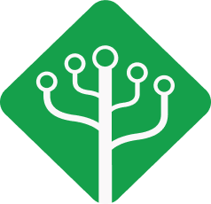
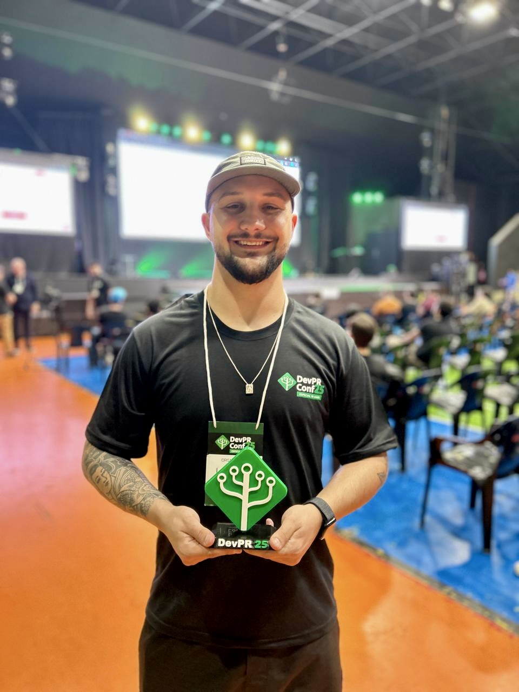
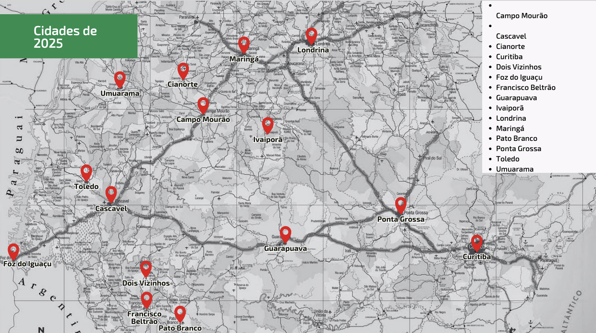
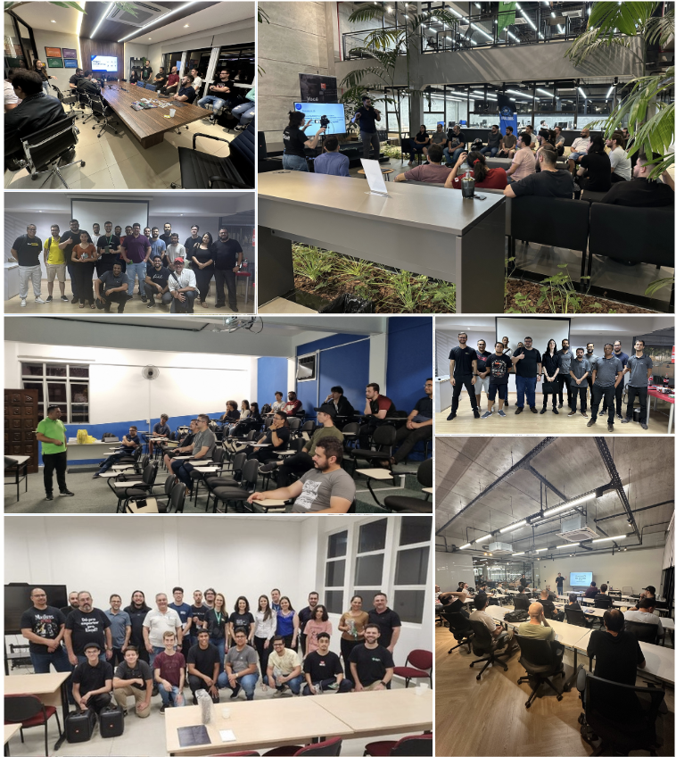
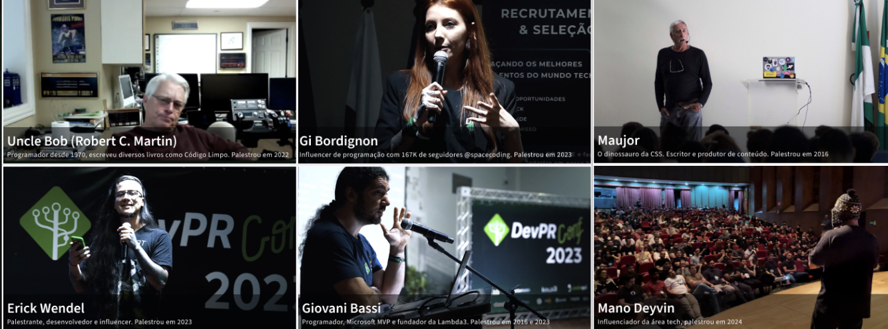
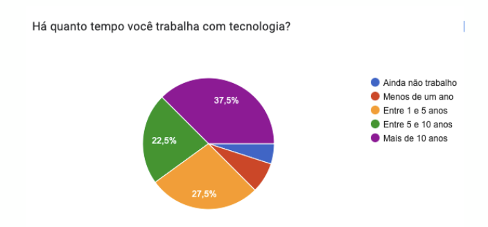

<!-- _header:  -->

<!-- Slide 1: Capa -->

# Apresentação da Comunidade

---

<!-- Slide 2: Apresentação Pessoal -->

**Luiz Schons**

23 anos

Senior Software Engineer — PicPay

Community Manager — DevParaná

---

<!-- Slide 3: História da Comunidade -->

## O que é a comunidade?

O DevParaná surgiu em **2015** e desde então tem conectado pessoas desenvolvedoras, entusiastas e empresas no ecossistema de tecnologia do Paraná.

Nossa missão é fomentar aprendizado contínuo, colaboração e oportunidades através de eventos presenciais, conteúdo e networking.

---

<!-- Slide 4: Cidades 2025 -->

---

<!-- Slide 5: Eventos Promovidos -->

## Eventos que já promovemos

- **DevParaná Conf**
- **DevParaná na Estrada**
- **Meetups mensais nas cidades**
- **Rodas de conversa**

---

<!-- Slide 6: Fotos dos Eventos -->

---

<!-- Slide 7: Fotos dos Palestrantes -->

---

<!-- Slide 8: Quem faz a comunidade? -->

## Quem faz a comunidade?

---

<!-- Slide 9: Foto do Público -->

---

<!-- Slide 10: Como posso ajudar? -->

## Como eu posso ajudar?

- **Palestrando**
- **Projetos Open Source** (devMX e Baas)
- **Disponibilizando espaços** (auditórios e etc)
- **Participando dos eventos**

---

<!-- Slide 11: Empresas Apoiadoras -->

## Empresas que já apoiaram o DevParaná:

- Grupo 3C
- DAM System
- Cilla Tech Park
- Michelc
- UTFPR
- Campo Real / Centro de Inovação
- Secretaria de Ciência, Tecnologia e Inovação
- ACT Tecnologia

---

<!-- Slide 12: Contato -->

## Contato

**WhatsApp:** 42 999146456

**Email:** luiz.schons@devpr.org

